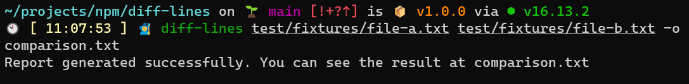

# diff-lines

[](https://app.travis-ci.com/ulisesantana/diff-lines)
[](https://codecov.io/gh/ulisesantana/diff-lines)
[](https://www.npmjs.com/package/@ulisesantana/diff-lines)
[](https://npmjs.org/package/@ulisesantana/diff-lines)
[](https://github.com/ulisesantana/diff-lines/blob/master/package.json)

This project make a diff between two files and extract the unique and common lines based only on values instead of values and position.



## Usage

```shell
USAGE: node diff-lines [OPTION1] [OPTION2]... arg1 arg2...
The following options are supported:
  -c, --common          Generate report with common values
  -o, --output <ARG1>   File where the report will be written
  -u, --unique          Generate report with unique values
```
